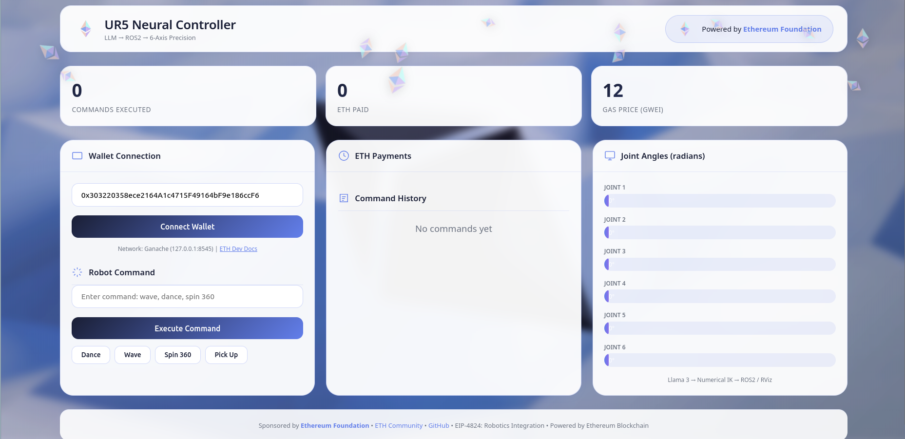
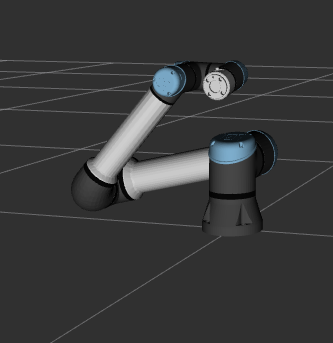
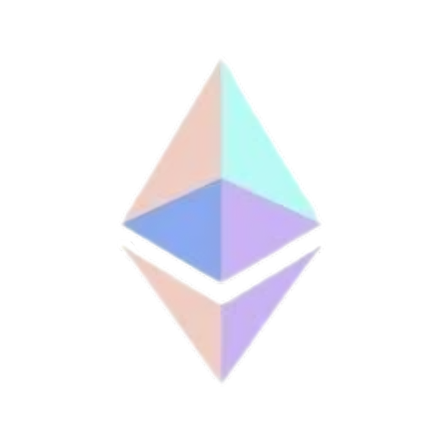

# UR5 Robot Commander | Tsion Dynamics

<p align="center">
  
</p>

---

## System Architecture

┌─────────────────┐ ┌─────────────────┐ ┌─────────────────┐ ┌─────────────────┐
│ │ │ │ │ │ │ │
│ Web UI │────▶│ Web3 │────▶│ ROS2 │────▶│ UR5 │
│ (Flask) │ │ Wallet │ │ Bridge │ │ Robot │
│ │ │ │ │ │ │ │
└─────────────────┘ └─────────────────┘ └─────────────────┘ └─────────────────┘
text


---

## Visual Gallery

<table width="100%">
  <tr>
    <td width="50%" align="center">
      
    </td>
    <td width="50%" align="center">
      
    </td>
  </tr>
</table>

<p align="center">
  <video src="static/cast.mp4" controls width="60%" loop autoplay muted></video>
</p>

---

## Sponsors

<table width="100%">
  <tr>
    <td width="50%" align="center">
      
      <br>
      <strong>Supported by Ethereum Foundation</strong>
     </td>
    <td width="50%" align="center">
      
      <br>
      <strong>Built by Tsion Dynamics</strong>
     </td>
  </tr>
</table>

<p align="center">
  <em>Special thanks to the Ethereum community for the vision and support that made this project possible.</em>
</p>

---

## Features

| Category | Description |
|----------|-------------|
| Blockchain Integration | Web3 wallet integration with Ethereum payments |
| Robot Control | Real-time UR5 robot control via ROS2 |
| Smart Contracts | Command execution with smart contract verification |
| Motion Planning | Smooth trajectory planning algorithms |
| User Interface | Interactive GUI override system |

---

## Quick Start

```bash
# Launch the robot controller
./start_robot.sh

# Launch without GUI
./launch_robot_no_gui.sh

# Clean launch
./launch_clean.sh

Wallet Connection

The system uses Ethereum smart contracts for payment verification.
python

# Smart contract: RobotPayment.sol
# Contract address: contract_address.txt

from web3 import Web3

w3 = Web3(Web3.HTTPProvider('http://localhost:8545'))
contract = w3.eth.contract(address=CONTRACT_ADDRESS, abi=CONTRACT_ABI)

Available Commands
Command	Description	Cost (ETH)
dance	Execute dance routine	0.05
spin 360	Full rotation	0.03
grab X Y Z	Pick object at coordinates	0.10
wave	Perform waving motion	0.02
reset	Return to home position	0.00
Robot Joint Control
text

Joint 1 (Base)       [████████░░░░░░░░░░░░] 75%
Joint 2 (Shoulder)   [██████░░░░░░░░░░░░░░] 60%
Joint 3 (Elbow)      [██████████░░░░░░░░░░] 100%
Joint 4 (Wrist 1)    [████░░░░░░░░░░░░░░░░] 40%
Joint 5 (Wrist 2)    [███████░░░░░░░░░░░░░] 70%
Joint 6 (Wrist 3)    [██████░░░░░░░░░░░░░░] 55%

Project Structure
text

.
├── app.py                      # Flask web application
├── ros2_bridge.py              # ROS2 communication layer
├── smooth_robot_controller.py  # Motion planning algorithms
├── override_gui.py             # Custom UI controls
├── RobotPayment.sol            # Ethereum smart contract
├── deploy_contract.py          # Contract deployment script
├── contract_address.txt        # Deployed contract address
├── start_robot.sh              # Main launch script
├── launch_clean.sh             # Clean launch script
├── launch_robot_no_gui.sh      # Headless launch script
├── static/                     # Images and media
│   ├── tsion.jpeg              # Brand logo
│   ├── hdeth.png               # Ethereum sponsor logo
│   ├── screen.png              # Screenshot 1
│   ├── image.png               # Screenshot 2
│   └── cast.mp4                # Demo video
├── templates/                  # HTML templates
└── ros_ws/                     # ROS2 workspace

Smart Contract Deployment
bash

# Deploy the payment contract
python3 deploy_contract.py

# Contract address saved to contract_address.txt

Requirements
Component	Specification
ROS2	Humble or Foxy
Python	3.8 or higher
Operating System	Ubuntu 20.04 or 22.04
Ethereum Client	Ganache or Geth
Web3 Library	Web3.py
File Reference
File	Purpose
ros2_bridge.py	Bridges ROS2 topics with web interface
smooth_robot_controller.py	Implements smooth motion planning
override_gui.py	Custom GUI overrides for manual control
RobotPayment.sol	Solidity smart contract for ETH payments
app.py	Flask backend server
Acknowledgments

This project draws inspiration from the Ethereum community's vision for decentralized robotic control systems. The integration of blockchain technology with industrial robotics opens new possibilities for secure, transparent, and programmable automation.
License

MIT License

Copyright (c) Tsion Dynamics
<p align="center"> <strong>Built by Tsion Dynamics</strong><br> Supported by Ethereum Foundation </p><p align="center"> <a href="#">Documentation</a> &nbsp; • &nbsp; <a href="#">Issues</a> &nbsp; • &nbsp; <a href="#">Discord</a>
